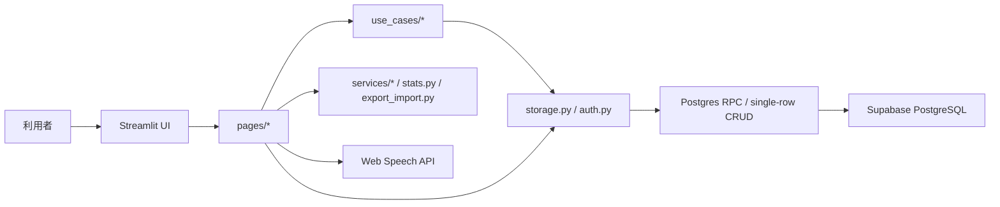

# アーキテクチャ概要

## 全体像

このアプリは Streamlit の単一プロセスアプリです。`app.py` が認証状態を判定し、ログイン済みなら5つのタブを描画します。永続化は Supabase PostgreSQL に集約され、Streamlit の `session_state` と Cookie はUI状態、セッション、短期キャッシュに使われます。

## レイヤー

### UI層

- `app.py`: ページ設定、CookieController初期化、認証判定、タブ構成、トップレベル例外処理。
- `pages/login_page.py`: ユーザー一覧ログイン、新規登録。
- `pages/sidebar.py`: ノルマ、ログアウト。
- `pages/add_card_page.py`: カード作成。
- `pages/review_page.py`: 日次ノルマ復習。
- `pages/manage_page.py`: 原文カードと暗記カードの編集/削除/再生成。
- `pages/listen_page.py`: 聞き流し。
- `pages/stats_page.py`: 統計とエクスポート/インポート。
- `components.py`: HTML/JavaScriptでの音声プレイヤー。

### アプリケーション/ドメイン寄りのロジック

- `services/card_service.py`: `【】` マーカーの解析、穴埋めカード生成、ハイライト適用。
- `services/review_service.py`: SM-2計算、日次出題候補の選択。
- `services/time_service.py`: アプリ基準日付を日本時間へ統一。
- `services/session_service.py`: ログアウトとユーザー切替時のユーザー依存状態を消去。
- `use_cases/card_models.py`: `CardDraft` と `SourceBundleCommand` の入力検証。
- `use_cases/card_workflows.py`: カード作成、再生成、インポートを検証してトランザクションRPCへ渡す。
- `use_cases/review_workflows.py`: 日次割当と復習完了の原子更新、migration欠落時だけの互換フォールバック。
- `stats.py`: 学習統計計算。
- `export_import.py`: JSON/CSV変換。
- `config.py`: カテゴリ、タイプ、ランク、アルゴリズム定数。

### インフラ/永続化

- `database.py`: Supabaseクライアント生成、接続情報解決、接続エラー。
- `auth.py`: ユーザー、ノルマ、セッション。
- `storage.py`: 所有者付き読み込み、単一行CRUD、日次割当・復習・原文束・インポートのRPC呼び出し。
- `supabase/migrations/`: 制約、権限、トランザクションRPCを管理する加算的migration。

## 主要フロー

### ログイン

1. `app.py` が `session_state.user_id` を確認する。
2. なければ Cookie の `session_token` を読む。
3. `auth.validate_session_token()` で `sessions` を確認する。
4. 有効なら `session_state` にユーザー情報を保存する。
5. 未認証なら `pages/login_page.py` を表示する。

登録済みユーザーを選んで `auth.login_user_direct()` でログインします。パスワードは使いません。

### カード作成

1. `pages/add_card_page.py` でカテゴリ、ランク、タイプ、タイトル、原文を入力する。
2. 穴埋めありタイプでは `services.card_service.parse_blanks_from_text()` が `【】` からカード候補を作る。
3. 保存前に `SourceBundleCommand` が属性・必須値・カード一覧を一括検証する。
4. `save_source_bundle` RPCが原文カードと暗記カードを同じDBトランザクションで保存する。
5. `storage.clear_cards_cache()` / `clear_source_cards_cache()` でキャッシュを破棄する。

### 復習

1. `pages/review_page.py` が `storage.load_cards()` でカードを読む。
2. `next_review <= today` のカードを抽出する。
3. 候補を選び、`sync_daily_assignments` RPCで当日のquota・削除済みカード・順序を毎回同期する。
4. ユーザーの自己評価を `calculate_next_review()` に渡す。
5. `complete_daily_review` RPCがカード進捗と割当完了を原子的・冪等に保存する。

### 管理

1. `pages/manage_page.py` が原文カードと暗記カードを読み込む。
2. 原文カードごとに紐づく暗記カードをUIで編集する。
3. 保存・再生成は検証済みpayloadを `save_source_bundle` RPCで一括更新する。
4. 穴埋め型と非穴埋め型をまたぐ変更は、再生成プレビューを経ない直接保存を拒否する。

### 統計/インポート/エクスポート

1. `stats.calculate_statistics()` がカードの状態から集計を作る。
2. `export_import.export_cards_json()` / `export_cards_csv()` が出力する。
3. `ImportPreview` がversion、型、必須値、参照関係、ファイル内重複を検証する。
4. 確認後に `import_backup_atomic` RPCが全件を保存し、1件でも失敗すれば全件を戻す。

## 現在の境界の弱い箇所

- 一部UI層がまだDB関数を直接呼ぶ。
- `dict[str, Any]` が多く、DB行、ドメインカード、UI入力の型が混在している。
- StreamlitのHTML描画に未エスケープのユーザー入力が入る。
- ログイン画面で任意のユーザーを選べるため、厳密な個人認証には向かない。
- 完全な初期スキーマの基準化は未完了だが、新規差分はSupabase CLIで管理している。

## 望ましい方向性

- ドメインモデルを `Card`, `SourceCard`, `User`, `ReviewState` として型定義する。
- Use case 層を広げ、UIからDBの直接操作をさらに減らす。
- DB操作をRepositoryに集約し、書き込み単位を明確にする。
- 厳密な個人認証が必要になった場合のみ、Supabase Authなどへ移行する。
- RLS、キー管理を設計し直す。
- HTML描画はエスケープ済みコンポーネントに限定する。
- スキーマを単一の再現可能なマイグレーション体系にする。
